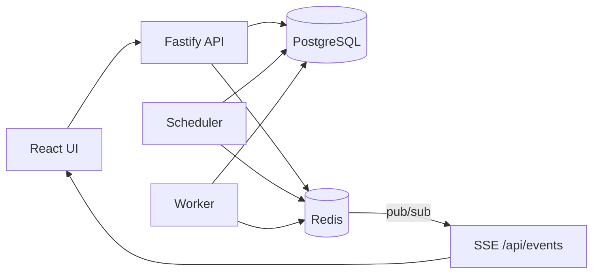

# Stage 9 Job Scheduler — Architecture

## Overview

A background job scheduler built for Dilamme (Stage 9). Jobs are created via REST API, queued in PostgreSQL, promoted to a ready queue by an independent **scheduler process**, and executed by independent **worker processes**. A React dashboard provides live visibility via Server-Sent Events (SSE).

## Process Architecture

| Process    | Port  | Role                                      |
| ---------- | ----- | ----------------------------------------- |
| API        | 3000  | REST, Swagger, SSE                        |
| Scheduler  | —     | Promote due jobs, aging, DLQ alerts       |
| Worker     | —     | Claim jobs, run handlers, retries         |
| Web UI     | 5173  | Dashboard, jobs table, create form, DLQ   |



## Job Lifecycle

Every job follows: **pending → processing → completed / failed / cancelled**

- **Scheduled jobs**: stay `pending` in DB until `scheduled_at <= now`
- **DAG jobs**: stay `pending` until all dependencies are `completed`
- **Retries**: on failure, job returns to `pending` with incremented `retry_count` and delayed `scheduled_at`
- **DLQ**: after 3 failed attempts, `status = failed`, `in_dlq = true`
- **Recurring**: on `completed`, same job row resets to `pending` with next `scheduled_at`

### Cancellation Policy

| State       | Behavior                                                                 |
| ----------- | ------------------------------------------------------------------------ |
| `pending`   | Immediately set to `cancelled`; never promoted to ready queue            |
| `processing`| Set `cancel_requested = true`; worker checks before and after handler    |

If cancelled during processing, the handler result is discarded and the job is marked `cancelled` without retry. The email handler is idempotent (mock SMTP), so partial side effects are acceptable for demo purposes.

## Heap-Based Priority Queue (Primary)

Location: `packages/core/src/min-heap.ts`

Jobs in the ready queue are ordered by a **min-heap** comparator:

1. **Effective priority** (1 = High, lower runs first)
2. **Scheduled time** (earlier first)
3. **Creation time** (FIFO tie-break)

Complexity: insert O(log n), extract-min O(log n).

The scheduler promotes due jobs into the heap and marks them `in_ready_queue = true` in PostgreSQL. Workers claim jobs using `SELECT … FOR UPDATE SKIP LOCKED` ordered by the same criteria.

## Timing Wheel (Alternative Algorithm)

Location: `packages/core/src/timing-wheel.ts`

A hierarchical timing wheel (60 slots × 1s + overflow) runs alongside the heap for scheduled/retry-delayed jobs. See `docs/BENCHMARKS.md` for performance comparison.

**Tradeoff**: timing wheel offers O(1) bucket insert for time-based scheduling; heap offers strict global priority ordering. Production path uses heap for dispatch ordering; timing wheel supports benchmarks and scheduled promotion.

## Starvation Prevention (Aging)

**Threshold: 30 seconds**

Every 30 seconds a job waits in `pending` (not yet in ready queue), its `effective_priority` decreases by 1, floored at 1 (High).

Example: priority 3 (Low) waiting 90s → effective priority 1 → competes with native High jobs, broken by scheduled_at then created_at.

Function: `computeEffectivePriority()` in `packages/core/src/aging.ts`

## Retry Backoff with Jitter

| Attempt | Base | Jitter range (±20%) |
| ------- | ---- | ------------------- |
| 1       | 1s   | 800ms – 1200ms      |
| 2       | 5s   | 4s – 6s             |
| 3       | 25s  | 20s – 30s           |

After attempt 3 fails → DLQ.

## Duplicate Protection

Two layers:

1. **PostgreSQL `FOR UPDATE SKIP LOCKED`** — atomic claim; concurrent workers skip locked rows
2. **Redis lock** `SET job:{id}:lock NX EX 300` — prevents double execution if worker restarts

## Dead-Letter Queue

- Jobs with `in_dlq = true` appear in `/api/dlq` and the DLQ UI tab
- Manual retry: `POST /api/dlq/:id/retry` resets retry count and returns job to pending
- **Alert threshold: 10 jobs** — when DLQ count ≥ 10, a `send_dlq_alert` job is created (mock email to admin)

## DAG Workflow

Table: `job_dependencies` links dependent jobs to prerequisites.

Example seed chain:

```
generate_report → upload_file → send_email
```

Circular dependencies are rejected at job creation time via graph traversal.

## Live Updates

**Approach: Server-Sent Events (SSE)**

1. Worker/scheduler/API publish to Redis channel `job:events`
2. API `/api/events` subscribes and streams to browsers
3. React `useJobEvents()` hook refreshes dashboard and tables

## Structured Logging

All services use Pino JSON logging with consistent `event` fields:

- `job.created`, `job.started`, `job.retry`, `job.failed`, `job.cancelled`, `job.completed`
- `dlq.threshold_exceeded`

## Data Stores

| Store      | Purpose                                              |
| ---------- | ---------------------------------------------------- |
| PostgreSQL | Jobs, dependencies, logs, durable state              |
| Redis      | Job locks, pub/sub events, ready queue sorted set    |

## Job Handlers

Registry in `packages/handlers`:

| Type               | Description                    |
| ------------------ | ------------------------------ |
| `send_email`       | Mock SMTP, ~10% failure rate   |
| `generate_report`  | DAG step 1                     |
| `upload_file`      | DAG step 2                     |
| `send_dlq_alert`   | DLQ threshold notification     |

## API Documentation

Swagger UI: `http://localhost:3000/docs`

Key endpoints:

- `POST /api/jobs` — create job
- `GET /api/jobs` — list jobs
- `PATCH /api/jobs/:id/cancel` — cancel
- `GET /api/dashboard/stats` — status counts
- `GET /api/dlq` — dead letter queue
- `POST /api/dlq/:id/retry` — manual retry
- `GET /api/events` — SSE stream
- `GET /api/benchmarks` — heap vs timing wheel numbers
