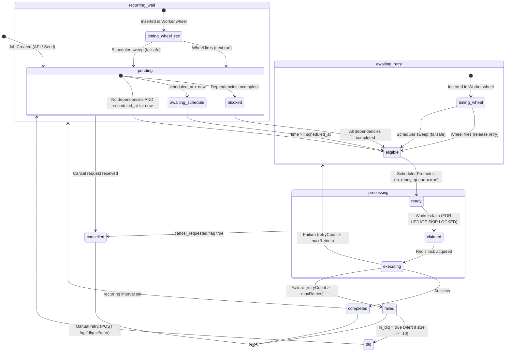

# Stage 9 Job Scheduler — System Architecture

This document details the architecture, process interaction, data models, state machines, and key algorithmic mechanisms of the background job scheduler designed for Dilamme (Stage 9).

---

## 1. System Overview

The Stage 9 Job Scheduler is a distributed, high-performance background processing system. It provides priority-based job execution, Directed Acyclic Graph (DAG) dependency workflows, dead-letter queueing (DLQ), and real-time visualization via a React dashboard.

### Core Architecture Philosophy
- **Single Source of Truth:** PostgreSQL (via Drizzle ORM) is the absolute authority. All states, scheduled times, logs, and relationships are persisted here. Redis is never used as queue storage.
- **Fail-Safe Processing:** Processes are independent, stateless, and safe to replicate. The worker uses Redis only for distributed locks to ensure claim-safety and pub/sub for UI events.
- **Fast-Path Hybrid Scheduling:** In-memory structures (Min-Heap in the scheduler, Timing Wheel in the workers) are mirrors used to accelerate lookup operations, backed by robust database recovery sweeps.

---

## 2. High-Level Architecture

The system is organized as a pnpm monorepo. It splits responsibility across four execution daemons and three shared utility packages.

### Component Port Mapping

| Process | Network Port | Role |
| :--- | :--- | :--- |
| **API Server** | `3200` | REST API, OpenAPI/Swagger docs, SSE Event Stream, health checks |
| **Scheduler Daemon** | — | Evaluates schedules, handles priority aging, checks DAGs, and triggers DLQ alert jobs |
| **Worker Daemon(s)** | — | Concurrent job execution, retry/recurring interval O(1) scheduling, and handler runner |
| **Web UI Client**| `5173` | React Dashboard, live SSE updates, job creator, DLQ manager, dependency picker |

### System Architecture Diagram

```mermaid
graph TB
    subgraph Client ["Client Layer"]
        WebUI["React Dashboard (Vite / App.tsx)"]
        ClientsAPI["REST API Clients (cURL / HTTP)"]
    end

    subgraph APIServer ["API Server (Fastify / apps/api)"]
        APIEndpoints["REST Endpoints (/api/*)"]
        SSEStream["SSE Event Broker (/api/events)"]
        Swagger["Swagger UI (/docs)"]
    end

    subgraph Datastores ["Storage & Messaging Layer"]
        DB[("PostgreSQL Database (Drizzle ORM)")]
        Redis[("Redis (Pub/Sub & Locks)")]
    end

    subgraph SchedulerProcess ["Scheduler Daemon Process (apps/scheduler)"]
        SchedulerLoop["Scheduler Loop (~500ms Tick)"]
        MinHeap["Indexed Min-Heap Mirror (packages/core)"]
    end

    subgraph WorkerProcess ["Worker Daemon Process(es) (apps/worker)"]
        WorkerLoop["Worker Poll Loop (~500ms)"]
        TimingWheel["Local Timing Wheel (packages/core)"]
        Handlers["Job Handlers (packages/handlers)"]
    end

    %% Client Interactions
    WebUI -->|REST Operations| APIEndpoints
    WebUI <-->|SSE Stream| SSEStream
    ClientsAPI -->|Job Management| APIEndpoints

    %% API Interactions
    APIEndpoints -->|Read/Write Schema| DB
    Swagger -->|API Spec| APIEndpoints

    %% Scheduler Interactions
    SchedulerLoop -->|1. Age Priorities| DB
    SchedulerLoop -->|2. Sync Aged Priorities| MinHeap
    SchedulerLoop -->|3. Sweep Overdue Delayed Jobs| DB
    SchedulerLoop -->|4. Promote Due Pending Jobs| DB
    SchedulerLoop -->|"5. Rebuild Heap (~60s)"| DB
    SchedulerLoop -->|Publish Promoted Events| Redis

    %% Worker Interactions
    WorkerLoop -->|"1. Atomic Claim (FOR UPDATE SKIP LOCKED)"| DB
    WorkerLoop -->|"2. Acquire Job Lock (NX EX 300)"| Redis
    WorkerLoop -->|3. Run Handlers| Handlers
    WorkerLoop -->|4. Register Retries / Recurring| TimingWheel
    WorkerLoop -->|5. Release Job Lock| Redis
    WorkerLoop -->|6. Write Logs & Status| DB
    WorkerLoop -->|Publish Exec Events| Redis

    TimingWheel -->|Fire Delay Elapsed| DB

    %% Messaging
    Redis -->|Pub/Sub Event Broadcast| SSEStream
```



---

## 3. Job Lifecycle & State Machine

Jobs move through a rigid transition pipeline: `pending ➔ processing ➔ completed / failed / cancelled`.

### Job Transition Rules
1. **Creation:** A job is born in a `pending` state. If it has parent dependencies, it stays blocked. If it is scheduled for the future, it stays idle.
2. **Promotion:** Once eligible (`scheduled_at <= now` and all parent dependencies are `completed`), the Scheduler promotes the job (`in_ready_queue = true`).
3. **Execution:** The Worker claims the promoted job (`status = 'processing'`) and locks it in Redis.
4. **Rescheduling & Retries:** On failure, the Worker increments `retryCount`. If `retryCount <= maxRetries`, the job status reverts to `pending` with `awaiting_retry = true` and is scheduled with backoff.
5. **Dead-Letter Queue (DLQ):** If retries are exhausted, the job status changes to `failed` and `in_dlq = true`. It can be manually retried back to `pending`.
6. **Recurring Runs:** If a job completes and has an `interval` property, the Worker registers the next schedule and sets `awaiting_retry = true`.
7. **Cancellation:** A job can be cancelled. If it is `pending`, it is cancelled immediately. If `processing`, a cancellation request flag is set, which the worker checks and handles safely.

### State Transition Diagram



---

## 4. Database Schema & Models

Database tables are defined using **Drizzle ORM** in `packages/db`.

### 1. `jobs` Table
The primary table tracking job configuration, execution state, and scheduler scheduling structures.

| Column | Type | Nullable | Default | Description |
| :--- | :--- | :--- | :--- | :--- |
| `id` | `uuid` | No | `defaultRandom()` | Primary Key |
| `type` | `varchar(100)` | No | — | Registered handler job key (e.g. `send_email`) |
| `payload` | `jsonb` | No | `{}` | Job parameters passed directly to handlers |
| `priority` | `integer` | No | `2` | Static Priority: `1` (High), `2` (Medium), `3` (Low) |
| `effectivePriority` | `integer`| No | `2` | Dynamic priority after starvation aging |
| `status` | `job_status` | No | `'pending'` | Status enum: `pending`, `processing`, `completed`, `failed`, `cancelled` |
| `retryCount` | `integer` | No | `0` | Number of executed failed runs |
| `maxRetries` | `integer` | No | `3` | Maximum allowed execution failures before DLQ |
| `scheduledAt` | `timestamp` | Yes| — | Executed time or delay delay end |
| `interval` | `job_interval` | Yes| — | Recurring interval enum: `every_1_minute`, `every_5_minutes`, `every_1_hour` |
| `error` | `text` | Yes| — | String representation of last thrown exception |
| `inDlq` | `boolean` | No | `false` | True if failed and moved to dead-letter queue |
| `cancelRequested` | `boolean` | No | `false` | Flag to request active worker abort execution |
| `inReadyQueue` | `boolean` | No | `false` | True when promoted and ready for worker claim |
| `awaitingRetry` | `boolean` | No | `false` | True when delayed by timing wheel (ignores scheduler sweep) |
| `lastPromotedAt` | `timestamp` | Yes| — | Timestamp of last scheduler promotion |
| `createdAt` | `timestamp` | No | `now()` | Job registration timestamp |
| `updatedAt` | `timestamp` | No | `now()` | State alteration timestamp |
| `startedAt` | `timestamp` | Yes| — | Active run claim timestamp |
| `completedAt` | `timestamp` | Yes| — | Successful processing complete timestamp |

### 2. `job_dependencies` Table
Tracks dependency rules. A row denotes that `jobId` is blocked until `dependsOnJobId` transitions to `completed`.

- **Primary Key:** `(jobId, dependsOnJobId)`
- **Foreign Keys:** Cascade delete references pointing to `jobs.id`.

### 3. `job_logs` Table (Audit Trail)
Mandatory audit ledger. Every status transition writes a row here **within the same database transaction** as the job update to maintain strict consistency.

- `id`: `uuid` Primary Key
- `jobId`: `uuid` Reference pointing to `jobs.id` (Cascade delete)
- `event`: `varchar(50)` (e.g. `job.created`, `job.promoted`, `job.started`, `job.completed`, `job.failed`, `job.cancelled`)
- `message`: `text` (detailed human-readable description)
- `metadata`: `jsonb` (contains event parameters like `retryAt`, `nextRunAt`, `effectivePriority`, etc.)
- `createdAt`: `timestamp` with timezone

---

## 5. Architectural Mechanisms

### A. The Hybrid Scheduling Model (Heap vs. Timing Wheel)
The scheduler combines two distinct algorithms to balance strict global execution order and highly performant local timers:

#### 1. Indexed Min-Heap Mirror (`packages/core/src/min-heap.ts` ➔ `IndexedJobHeap`)
Used in the **Scheduler process** to track ready-to-run jobs in memory.
- **Ordering Comparator:**
  1. `effectivePriority` (asc: lower priority number runs first)
  2. `scheduledAt` (asc: earlier times run first)
  3. `createdAt` (asc: FIFO fallback for tie-breaker)
- **Efficiency:** The `IndexedJobHeap` maps `jobId ➔ heapIndex` internally in a `Map`. This enables O(log n) decrease-priority/update updates and job removal, alongside O(1) peek.
- **Drift Sync:** The heap is rebuilt on startup and every ~60 seconds (120 scheduler ticks) from the database to correct drift.

#### 2. Process-Local Timing Wheel (`packages/core/src/timing-wheel.ts` ➔ `TimingWheel`)
Used in the **Worker processes** to manage short-term delays (retries and recurring runs).
- **Structure:** 60 slots with a 1-second resolution, plus an overflow list for delays exceeding 60 seconds.
- **Why Timing Wheel?** It reduces database polling for upcoming tasks, allowing workers to hold retry delays in process-local RAM with O(1) insertion time.

#### 3. Durable Synchronization & Recovery Net
Because the timing wheel is local to worker RAM, the system includes a fail-safe recovery mechanism:
1. When a job is delayed, its database column `awaitingRetry` is set to `true`, and its `scheduledAt` is saved.
2. In every scheduler tick, a sweep runs:
   ```sql
   UPDATE jobs
   SET awaiting_retry = false
   WHERE awaiting_retry = true AND scheduled_at <= NOW() AND status = 'pending'
   ```
3. Re-releasing is idempotent. If a worker timing wheel triggers a release, it updates the database where `awaiting_retry = true`. The scheduler sweep also updates where `awaiting_retry = true`. Both trigger the release safely without duplicates.
4. On startup, workers rebuild their local timing wheels by fetching all database rows where `awaitingRetry = true`.

---

### B. Starvation Prevention (Priority Aging)
To prevent high-priority jobs from indefinitely blocking lower-priority jobs, the system implements dynamic priority aging:
- **Threshold:** 30 seconds (`AGING_INTERVAL_MS`).
- **Algorithm:** For every 30 seconds a job stays in `pending` (excluding jobs awaiting retries or cancelled), its `effectivePriority` decreases by 1 (which elevates its urgency), floored at `1` (High).
  $$\text{effectivePriority} = \max(1, \text{priority} - \lfloor\frac{\text{now} - \text{createdAt}}{30\text{ seconds}}\rfloor)$$
- **Execution:**
  1. The Scheduler updates the database values periodically via a bulk sweep.
  2. For jobs already in the ready queue, the Scheduler calls `IndexedJobHeap.updatePriority(job.id, newPriority)` to update the heap in O(log n) time.
  3. Workers claim jobs by ordering against the database's `effectivePriority` directly, preventing execution of stale orders.

---

### C. Claim Safety & Concurrency Control
To support multiple concurrent worker processes without duplicate execution, the system employs double-guarantees:

1. **Database Locking (`SELECT FOR UPDATE SKIP LOCKED`):**
   Workers query the database to claim ready jobs.
   ```sql
   UPDATE jobs
   SET status = 'processing', started_at = NOW(), in_ready_queue = false
   WHERE id = (
     SELECT id FROM jobs
     WHERE status = 'pending' AND in_ready_queue = true AND in_dlq = false AND cancel_requested = false AND awaiting_retry = false
     ORDER BY effective_priority ASC, scheduled_at ASC NULLS FIRST, created_at ASC
     FOR UPDATE SKIP LOCKED
     LIMIT 1
   )
   RETURNING *;
   ```
   PostgreSQL skips already-locked rows and guarantees that exactly one worker acquires the row atomically.

2. **Redis Distributed Locking:**
   Once a worker claims a job, it acquires a Redis key `job:{id}:lock` using NX mode (`SET job:id:lock NX EX 300`). This ensures that even if a worker crashes and restarts, or database timeouts occur, no other worker runs the same job payload concurrently.

---

### D. Exponential Backoff with Jitter
Failed jobs are retried up to 3 times before being sent to the Dead-Letter Queue (DLQ). The delay is calculated with a $\pm 20\%$ jitter:

$$\text{delay} = \text{BaseDelay} \times (1 \pm \text{RandomJitter})$$

| Attempt | Base Delay | Jittered Interval Range |
| :--- | :--- | :--- |
| 1 | 1s | 800ms – 1.2s |
| 2 | 5s | 4.0s – 6.0s |
| 3 | 25s| 20.0s – 30.0s|
| 4 | — | Sent to Dead-Letter Queue (DLQ) |

---

### E. Directed Acyclic Graph (DAG) Workflows
Jobs can form execution graphs (e.g., `generate_report ➔ upload_file ➔ send_email`):
- **Cycle Prevention:** A Depth-First Search (DFS) cycle-detection algorithm rejects circular dependency lists during job creation.
- **Dependency Evaluation:** When the Scheduler polls eligible jobs, it checks dependencies using `areDependenciesCompleted(jobId)`. If any parent job is not `completed`, the child job is skipped and remains in `pending` state.

---

### F. Job Cancellation Semantics
- **Pending Cancel:** If a job has not started, its status is changed immediately to `cancelled` and `inReadyQueue` is set to `false`.
- **Processing Cancel:** If a worker is running the job, the database field `cancelRequested` is set to `true`.
  - The worker checks this flag **before execution** (to skip the job handler).
  - The worker checks the flag **after execution** (discards output, marks the status `cancelled`, and cancels retries or recurring schedules).

---

### G. Live Updates (SSE Pub/Sub)
Real-time dashboard visualization is achieved using Redis Pub/Sub:
- State changes publish event objects to the `job:events` Redis channel.
- The Fastify server listens to this channel and pipes data into an active Server-Sent Events (SSE) route at `/api/events`.
- React hook `useJobEvents()` listens to the SSE stream and reactively triggers target dataset refetches.

---

## 6. Process Management & Deployment

The production processes are run on virtual machines (VPS) using standard Linux **systemd** services.

### Nginx Routing and SSE Buffering
Nginx acts as a reverse proxy. Because Nginx buffers upstream responses by default, SSE streams can lag or fail. The Nginx configuration turns off buffering specifically for `/api/events`:

```nginx
location /api/events {
    proxy_pass http://127.0.0.1:3200/api/events;
    proxy_http_version 1.1;
    proxy_set_header Connection '';
    proxy_buffering off;
    proxy_cache off;
    proxy_read_timeout 86400;
}
```

### systemd Service Configuration
All processes are managed as individual services.

#### 1. API Server (`/etc/systemd/system/stage9-api.service`)
```ini
[Unit]
Description=Stage 9 Job Scheduler - API Server
After=network.target postgresql.service redis-server.service

[Service]
Type=simple
User=stage9
WorkingDirectory=/opt/stage9
ExecStart=/usr/bin/pnpm --filter @scheduler/api start
Restart=always
Environment=NODE_ENV=production

[Install]
WantedBy=multi-user.target
```

#### 2. Scheduler Daemon (`/etc/systemd/system/stage9-scheduler.service`)
```ini
[Unit]
Description=Stage 9 Job Scheduler - Scheduler Daemon
After=network.target postgresql.service redis-server.service

[Service]
Type=simple
User=stage9
WorkingDirectory=/opt/stage9
ExecStart=/usr/bin/pnpm --filter @scheduler/scheduler start
Restart=always
Environment=NODE_ENV=production

[Install]
WantedBy=multi-user.target
```

#### 3. Worker Daemon (`/etc/systemd/system/stage9-worker.service`)
```ini
[Unit]
Description=Stage 9 Job Scheduler - Worker Daemon
After=network.target postgresql.service redis-server.service

[Service]
Type=simple
User=stage9
WorkingDirectory=/opt/stage9
ExecStart=/usr/bin/pnpm --filter @scheduler/worker start
Restart=always
Environment=NODE_ENV=production

[Install]
WantedBy=multi-user.target
```
